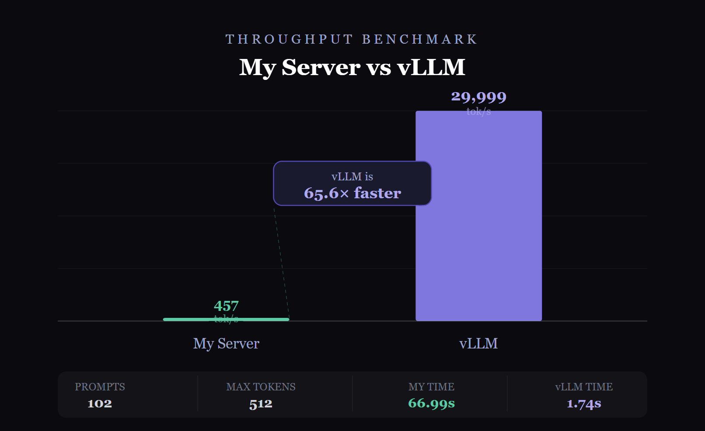

# Tokn
LLM Inference server
Developing my own LLM Inference server like vLLM. 

## Right now it supports
1. Online and Offline mode.
2. KV Caching
3. Multiple requests processing.
4. Scheduler to schedule requests.
5. Seperate prefill and Decode.
6. Prefix Caching
7. Continuous batching
8. Chunked prefill

## Things are coming

1. Torch compilation
2. CUDA Graphs
3. Speculative decoding
4. Quantization
5. Distributed inference
   etc.

## Current State

|total request | tokn | vLLM |
|----|----|----|
| 102 | 457 tok/sec | 30,000 tok/sec|

