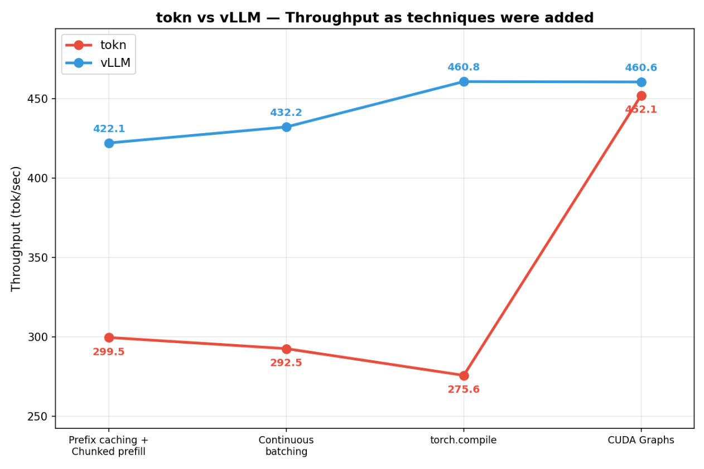
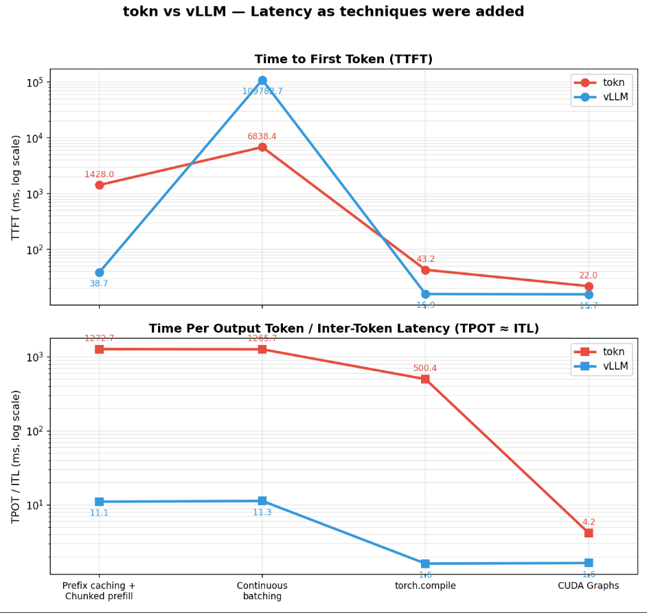

# Tokn(LLM Inference server)

Developing my own LLM Inference server like vLLM. To understand the core concepts deeply by implementing them from scratch.

## Right now it supports

1. Online and Offline mode.
2. KV Caching
3. Multiple requests processing.
4. Requests scheduler.
5. Seperate prefill and Decode.
6. Prefix caching
7. Continuous batching
8. Chunked prefill
9. Torch compilation
10. CUDA Graphs
11. Distributed inference (TP)

## Coming up

1. Speculative decoding
2. Quantization

## Summary
While doing the developement of each of above major techniques. I compared the tokn with vLLM and logged the numbers for Throughtput, TTFT, TPOT, ITL etc.

### Throughput

### Latency

---

## Benchmarks: tokn vs. vLLM

My first log after doing some core techniques implementation. I randomly benchmarked tokn with vLLM on 102 prompt.

| total request |	tokn	| vLLM |
| --- | --- | --- |
| 102 | 457 tok/sec | 30,000 tok/sec |

---

From this point on I generated proper synthetic dataset to benchmark tokn properly with vLLM.
400 prompts (mixed lengths), Qwen3-0.6B, `bf16`, `max_tokens=256`, `max_model_len=2048`, greedy decoding.

## 1. First Log

### Techniques Added: 
- **prefix caching**
- **chunked prefill**.

### Throughput

| Framework | Prompts | Output tokens | Elapsed (s) | Throughput (tok/s) |
| --- | --- | --- | --- | --- |
| tokn | 400 | 97,271 | 324.767 | 299.51 |
| vLLM | 400 | 97,367 | 230.673 | 422.10 |

vLLM is **1.41×** tokn throughput.

### Latency (ms)

| Framework | Metric | mean | p50 | p99 |
| --- | --- | --- | --- | --- |
| tokn | TTFT | 1428.04 | 1436.82 | 2266.79 |
| tokn | TPOT | 1272.70 | 1265.89 | 1332.04 |
| tokn | ITL | 1270.39 | 1313.34 | 1336.92 |
| vLLM | TTFT | 38.68 | 35.38 | 48.11 |
| vLLM | TPOT | 11.09 | 11.08 | 11.20 |
| vLLM | ITL | 11.09 | 11.08 | 11.20 |

## 2. Second log

### Techniques Added:
- **Continuous batching**

### Throughput

| Framework | Prompts | Output tokens | Elapsed (s) | Throughput (tok/s) |
| --- | ---: | ---: | ---: | ---: |
| tokn | 400 | 97,271 | 332.574 | 292.48 |
| vLLM | 400 | 97,380 | 225.318 | 432.19 |

vLLM is **1.48×** tokn throughput.

### Latency (ms)

| Framework | Metric | mean | p50 | p99 |
| --- | --- | ---: | ---: | ---: |
| tokn | TTFT | 6,838.45 | 6,854.68 | 13,074.27 |
| tokn | TPOT | 1,265.68 | 1,265.10 | 1,347.11 |
| tokn | ITL | 1,263.50 | 1,330.38 | 1,369.50 |
| vLLM | TTFT | 109,782.67 | 109,391.16 | 217,906.05 |
| vLLM | TPOT | 11.35 | 11.34 | 11.55 |
| vLLM | ITL | 11.35 | 11.34 | 11.55 |

## 3. Third Log

### Techniques Added:
- torch.compile

### Throughput

| Framework | Prompts | Output tokens | Elapsed (s) | Throughput (tok/s) |
| --- | ---: | ---: | ---: | ---: |
| tokn | 400 | 97,686 | 354.395 | 275.64 |
| vLLM | 400 | 96,959 | 210.419 | 460.79 |

vLLM is **1.67x** tokn throughput.

### Latency (ms)

| Framework | Metric | mean | p50 | p99 |
| --- | --- | ---: | ---: | ---: |
| tokn | TTFT | 43.19 | 19.93 | 141.94 |
| tokn | TPOT | 500.39 | 592.36 | 728.12 |
| tokn | ITL | 501.01 | 541.41 | 876.72 |
| vLLM | TTFT | 15.90 | 16.69 | 28.63 |
| vLLM | TPOT | 1.62 | 1.60 | 3.37 |
| vLLM | ITL | 1.62 | 1.60 | 3.37 |

TTFT = time to first token, TPOT = time per output token, ITL = inter-token latency.

## 4. Fourth Log

### Techniques Added:
- CUDA Graphs

### Throughput

| Framework | Prompts | Output tokens | Elapsed (s) | Throughput (tok/s) |
| --- | ---: | ---: | ---: | ---: |
| tokn | 400 | 97,003 | 214.540 | 452.14 |
| vLLM | 400 | 96,924 | 210.451 | 460.55 |

vLLM is **1.02×** tokn throughput.

### Latency (ms)

| Framework | Metric | mean | p50 | p99 |
| --- | --- | ---: | ---: | ---: |
| tokn | TTFT | 22.01 | 20.30 | 44.39 |
| tokn | TPOT | 4.20 | 4.15 | 6.11 |
| tokn | ITL | 4.20 | 4.00 | 8.33 |
| vLLM | TTFT | 15.70 | 16.48 | 28.30 |
| vLLM | TPOT | 1.65 | 1.62 | 3.38 |
| vLLM | ITL | 1.65 | 1.62 | 3.38 |

